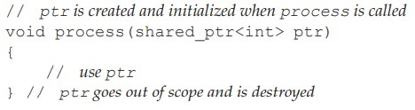

# Chapter 12: Dynamic Memory  

## Exercises  

### 1. How many elements do b1 and b2 have at the end of this code?  

```cpp
StrBlob b1;
{
    StrBlob b2 = {"a", "an", "the"};
    b1 = b2;
    b2.push_back("about");
}
```

> Both b1 and b2 have 4 elements, since the underlying vector adopts copy but not deep copy so they points to the same memory blocks.  
> The end scope just decrement StrBlob's reference count so the destruct of b2 has nothing to do with b1.  

### 2. Write your own version of the StrBlob class including the const versions of front and back.  

```cpp
const std::string& front() const
{
    check(0, "front on empty StrBlob");
    return data->front();
}
const std::string& back() const
{
    check(0, "back on empty StrBlob");
    return data->back();
}
```

[ex12_02.h](./ex12_2.h)  
[ex12_02.cpp](./ex12_2.cpp)  

### 3. Does this class need const versions of push_back and pop_back? If so, add them. If not, why aren’t they needed?  

> It doesn't need them, since the const just needs read-only method.  

### 4. In our check function we didn’t check whether i was greater than zero. Why is it okay to omit that check?  

> `size_type` is just an unsigned integer, when a value lower than 0 is passed to it, it will automatically underflow to an horribly large number.  

Aside:  

To measure the size of `size_type` of a container:  

```cpp
#include<iostream>
#include<vector>
#include<string>

using std::vector;
using std::string;


int main(){
    printf("%lu\n", sizeof(vector<string>::size_type));//8
    return 0;
}
```

### 5. We did not make the constructor that takes an initializer_list explicit (§ 7.5.4, p. 296). Discuss the pros and cons of this design choice.  

> When the constructor is not explicit, it means we can pass the `initializer_list` to implicitly transform to `StrBlob`. Since the underlying `vector<string>` is just another form of sequence, namely, `initializer_list`, so logically it does make sense not to declare it as `explicit`.  However this does generate some unexpected bugs and behaviors that are not as desired.  

### 6. Write a function that returns a dynamically allocated vector of ints. Pass that vector to another function that reads the standard input to give values to the elements. Pass the vector to another function to print the values that were read. Remember to delete the vector at the appropriate time. 

[ex12_06.cpp](./ex12_06.cpp)  

### 7. Redo the previous exercise, this time using shared_ptr.  

[ex12_07.cpp](./ex12_07.cpp)    

### 8. Explain what if anything is wrong with the following function.  

```cpp
bool b() {
int* p = new int;
// ...
return p;
}
```

> A pointer is usually a 8-byte address, the transformation from `int*` to `bool` truncated the extra 7 bytes(since bool only occupys 1 bit) and the following function or code that use this result returned by `b()` will trigger some unexpected error.  

### 9. Explain what happens in the following code:  

```cpp
int *q = new int(42), *r = new int(100);
r = q;
auto q2 = make_shared<int>(42), r2 = make_shared<int>(100);
r2 = q2;
```

> the original area `r` pointed to leaked.
> when `r2 = q2` is executed, the reference count of `q2` incremented, `r2` decremented to 0 and thus the memory r2 originally pointed to will be released.  

result generated by `valgrind --leak-check=yes ./a.out`  

```==2322== LEAK SUMMARY:
==2322==    definitely lost: 8 bytes in 2 blocks
==2322==    indirectly lost: 0 bytes in 0 blocks
==2322==      possibly lost: 0 bytes in 0 blocks
==2322==    still reachable: 0 bytes in 0 blocks
==2322==         suppressed: 0 bytes in 0 blocks
==2322== 
==2322== For lists of detected and suppressed errors, rerun with: -s
==2322== ERROR SUMMARY: 2 errors from 2 contexts (suppressed: 0 from 0)
```

### 10. Explain whether the following call to the process function defined on page 464 is correct. If not, how would you correct the call?

```cpp
shared_ptr<int> p(new int(42));
process(shared_ptr<int>(p));
```  



> What this code intend to do is to duplicate another `shared_ptr` to the parameter of `process`. This new `shared_ptr` has the reference count of 2 because it reference the memory of 42 ints twice.  When it reaches the end of the scope, the temporary `shared_ptr` will be destroyed and the reference count of original p will simply decremented to 1, correct.  

### 11. What would happen if we called process as follows?  

```cpp
process(shared_ptr<int>(p.get()));
```

> This is more than sad, since we intentionally avoid the way to increment the p's reference count. Rather, we use its raw pointer. So by the end of the `process`, the reference count of this temporary shared_ptr will decrement to 0 from 1, and the corresponding memory will be destroyed.  

### 12. Using the declarations of p and sp explain each of the following calls to process. If the call is legal, explain what it does. If the call is illegal, explain why:

```cpp
auto p = new int();
auto sp = make_shared<int>();
```

(a) process(sp);  
> Legal. When it enters the parameter list, it will duplicate a copy of itself so the ref count will be like this: 1->2->1.   

(b) process(new int());
> illegal. ref count 0->1->0, more than sad, memory leak occurs.  

(c) process(p);
> illegal. The same behavior like `process(shared_ptr<int>(p.get()));` ref count 0->1->0.  

(d) process(shared_ptr<int>(p));  
> legal. But the subsequent operation may result in a failure since the underlying p still point to a block of memory that's already freed.  

### 13. What happens if we execute the following code?  

```cpp
auto sp = make_shared<int>();
auto p = sp.get();
delete p;
```

> The subsequent behavior of sp is undefined.  

### 14. Write your own version of a function that uses a shared_ptr to manage a connection

[ex12_14.cpp](./ex12_14.cpp)  

### 15.  Rewrite the first exercise to use a lambda (§ 10.3.2, p. 388) in place of the end_connection function.  

[ex12_15.cpp](./ex12_15.cpp)


### 16. 