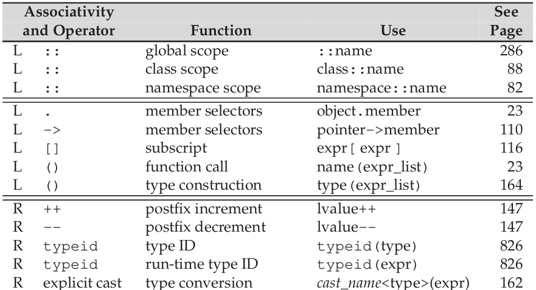
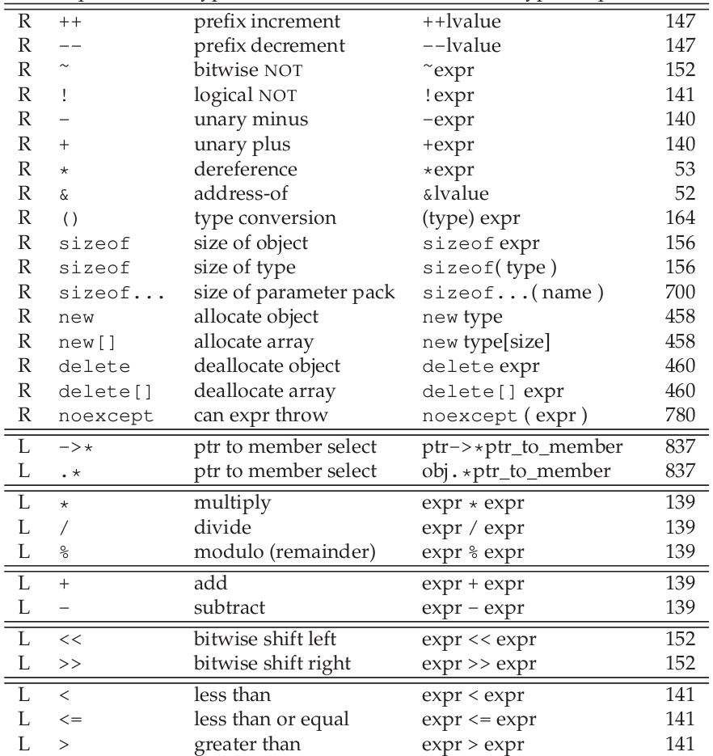
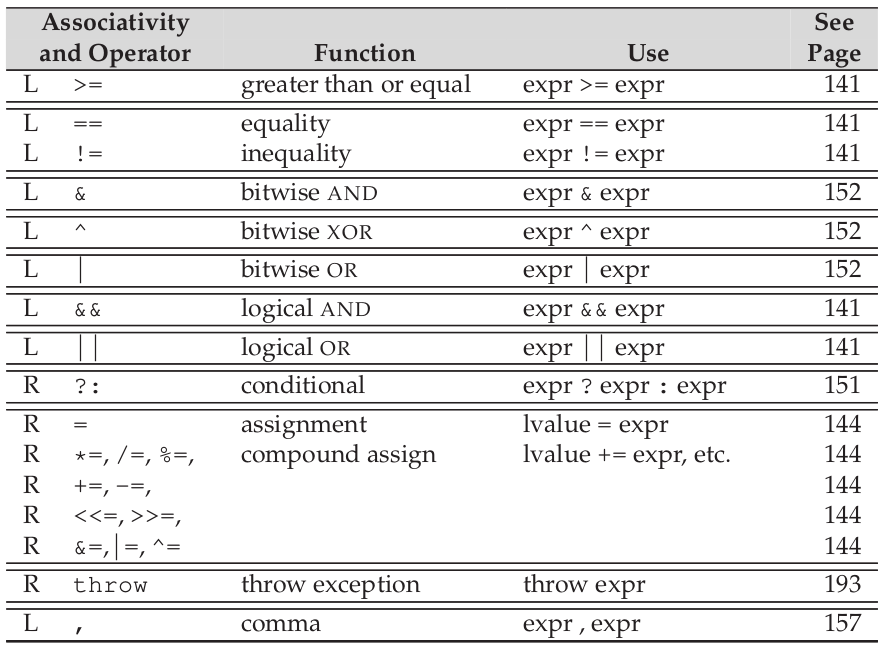

# Chapter 4 Expressions  

Precedence Table  

  
  
  


#### 4.1. What is the value returned by 5 + 10 * 20/2?  

> 105.

#### 4.2. Using Table 4.12 (p. 166), parenthesize the following expressions to indicate the order in which the operands are grouped:  

```cpp
* vec.begin() //=> *(vec.begin())
* vec.begin() + 1 //=> (*(vec.begin())) + 1
```  

#### 4.3. Order of evaluation for most of the binary operators is left undefined to give the compiler opportunities for optimization. This strategy presents a trade-off between efficient code generation and potential pitfalls in the use of the language by the programmer. Do you consider that an acceptable trade-off? Why or why not?  

> I think it necessary to hold the trade-off. Because the speed is always the biggest advantage of C++.   

> cout << i << ++i <<endl should never appear in your code.  

#### 4.4. Parenthesize the following expression to show how it is evaluated. Test your answer by compiling the expression (without parentheses) and printing its result.  

```
12 / 3 * 4 + 5 * 15 + 24 % 4 / 2
```

> ((12 / 3) * 4) + (5 * 15) + ((24 % 4) / 2)  

#### 4.5. Determine the result of the following expressions.  

(a) -30 * 3 + 21 / 5  
> -86

(b) -30 + 3 * 21 / 5  
> -18  

(c) 30 / 3 * 21 % 5  
> 0

(d) -30 / 3 * 21 % 4  
> -2  

#### 4.6. Write an expression to determine whether an int value is even or odd.  

```cpp
i % 2 == 0 ? "even" : "odd"
```

#### 4.7. What does overflow mean? Show three expressions that will overflow.  

```cpp
short svalue = 32767; ++svalue; // -32768
int ivalue = INT_MAX; --ivalue;  // INT_MIN
unsigned short usvalue = 65535; ++usvalue;  // 0
```  

#### 4.8. Explain when operands are evaluated in the logical AND , logical OR , and equality operators.  

+ logical AND : the second operand is evaluated if and only if the left side is true.
+ logical OR : the second operand is evaluated if and only if the left side is false
+ equality operators : true only if both operands have the same value, otherwise, it returns false.  

#### 4.9. Explain the behavior of the condition in the following if:  

```cpp
const char *cp = "Hello World";
if (cp && *cp)
```

> cp is not nullptr and *cp doesnot point to '\0'.  

> When the first condition fails, the second condition will not be evaluated.  

#### 4.10. Write the condition for a while loop that would read ints from the standard input and stop when the value read is equal to 42.  

```cpp
int i = 0;
while(cin >> i && i != 42)
```  

#### 4.11. Write an expression that tests four values, a, b, c, and d, and ensures that a is greater than b, which is greater than c, which is greater than d.  

```cpp
a > b && b > c && c > d
```

#### 4.12. Assuming i, j, and k are all ints, explain what i != j < k means.  

> i != j < k is same as i != (j < k)  

> Comparing a int with bool is a bad idea.  

#### 4.13. What are the values of i and d after each assignment?  

```cpp
int i;  
double d;  
``` 

(a) d = i = 3.5;// d = 3.0, i = 3;
(b) i = d = 3.5;// d = 3.5, i = 3;  

#### 4.14. Explain what happens in each of the if tests:  

```cpp
if (42 = i)//compile error: expression is not assignable
if (i = 42)//true. 
// ...
// ...
```

#### 4.15. The following assignment is illegal. Why? How would you correct it?  

```cpp
double dval; 
int ival; 
int *pi;
dval = ival = pi = 0;
// pi is a pointer to int.
// can not assign to 'int' from type 'int *'
// correct it:
dval = ival = 0;
pi = 0;
```

#### 4.16. Although the following are legal, they probably do not behave as the programmer expects. Why? Rewrite the expressions as you think they should be.  

(a) if (p = getPtr() != 0)
```cpp
if ((p = getPtr()) != 0)
```
(b) if (i = 1024)  
```cpp
if (i == 1024)
```

#### 4.17. Explain the difference between prefix and postfix increment.  


+ The postfix operators increment(or decrement) the operand but yield a copy of the original, unchanged value as its result.

+ The prefix operators return the object itself as an lvalue.

+ The postfix operators return a copy of the object's original value as an rvalue.  


#### 4.18. What would happen if the while loop on page 148 that prints the elements from a vector used the prefix increment operator?

```cpp
auto pbeg = v.begin();
// print elements up to the first negative value
while (pbeg != v.end() && *beg >= 0)
cout << *pbeg++ << endl; // print the current value and advance pbeg
```

> It will print from the second element and dereference v.end() at last.(It's undefined and very dangerous)
#### 4.19. Given that ptr points to an int, that vec is a vector<int>, and that ival is an int, explain the behavior of each of these expressions. Which, if any, are likely to be incorrect? Why? How might each be corrected?  

(a) ptr != 0 && *ptr++  
> check ptr is not a nullptr. and check the pointer value and then increment it.  

(b) ival++ && ival  
> check ival and ival+1 whether equal zero.  

(c) vec[ival++] <= vec[ival]  
> incorrect, undefined behavior.  
```cpp
//FIXED:
vec[ival] <= vec[ival+1]
```  

#### 4.20. Assuming that iter is a vector<string>::iterator, indicate which, if any, of the following expressions are legal. Explain the behavior of the le- gal expressions and why those that aren’t legal are in error.  


(a) [*iter++;](./ex4_20.cpp)// Dereference iter and then increment iter.  
(b) (*iter)++;//Illgeal, cannot increment a std::string type  
(c) *iter.empty()//`.` and `()` 's precedence are greater than dereference.    
(d) iter->empty();//indicate the iter' value whether empty.  
(e) ++*iter;//illegal, string cannot increment.  
(f) iter++->empty();  // see if it is empty and increment the iterator.  


#### 4.21. Write a program to use a conditional operator to find the elements in a vector<int> that have odd value and double the value of each such element.  

[ex4_21.cpp](./ex4_21.cpp)  

```
➜  ch04 git:(master) ✗ g++ ex4_21.cpp
➜  ch04 git:(master) ✗ ./a.out
2 2 6 4 10 6 14 8 18 
➜  ch04 git:(master) ✗ 
```  

#### 4.22. Extend the program that assigned high pass, pass, and fail grades to also assign low pass for grades between 60 and 75 inclusive. Write two versions: One version that uses only conditional operators; the other should use one or more if statements. Which version do you think is easier to understand and why?  

[ex4_22.cpp](./ex4_22.cpp)  

```
➜  ch04 git:(master) ✗ g++ ex4_22.cpp
➜  ch04 git:(master) ✗ ./a.out
80
pass
pass
70
low pass
low pass
50
fail
fail
100
high pass
high pass
1000
high pass
high pass
```  

#### 4.23. The following expression fails to compile due to operator precedence. Using Table 4.12 (p. 166), explain why it fails. How would you fix it?  

```cpp
string s = "word";
string pl = s + s[s.size() - 1] == ’s’ ? "" : "s" ;
```

> `+` 's precedence is greater than `?:`. So it will finally evaluate to `wordd == 's' ? "" : "s";`.  


#### 4.24. Our program that distinguished between high pass, pass, and fail depended on the fact that the conditional operator is right associative. Describe how that operator would be evaluated if the operator were left associative.  

if the operator were left associative.

```cpp
finalgrade = (grade > 90) ? "high pass" : (grade < 60) ? "fail" : "pass";
```
would same as :

```cpp
finalgrade = ((grade > 90) ? "high pass" : (grade < 60)) ? "fail" : "pass";
```  

> if grade > 90, first conditional operator's result is high pass. so the finalgrade is always fail.  

#### 4.25. What is the value of ~’q’ << 6 on a machine with 32-bit ints and 8 bit chars, that uses Latin-1 character set in which ’q’ has the bit pattern 01110001?  

```
'q' == 01110001

~ 'q' == ~ 00000000000000000000000001110001

~ 'q' == 11111111111111111111111110001110
```

[bitwise-operators-and-signed-types](https://stackoverflow.com/questions/28141871/bitwise-operators-and-signed-types)  

> You're quite correct -- the expression ~'q' << 6 is undefined behavior according to the standard. Its even worse than you state, as the ~ operator is defined as computing "The one's complement" of the value, which is meaningless for a signed (2s-complement) integer -- the term "one's complement" only really means anything for an unsigned integer.

> When doing bitwise operations, if you want strictly well-defined (according to the standard) results, you generally have to ensure that the values being operated on are unsigned. You can do that either with explicit casts, or by using explicitly unsigned constants (U-suffix) in binary operations. Doing a binary operation with a signed and unsigned int is done as unsigned (the signed value is converted to unsigned).

> C and C++ are subtley different with the integer promotions, so you need to be careful here -- C++ will convert a smaller-than-int unsigned value to int (signed) before comparing with the other operand to see what should be done, while C will compare operands first.


#### 4.26. In our grading example in this section, what would happen if we used unsigned int as the type for quiz1?  

> There are 30 students in the example of this section. unsigned long have at least 32 bits on any machine. Thus, it is ensured that the bits start out with well-define values. The standard define that unsigned int is guaranteed to hold 16 bits. If unsigned int adopted, the result is undefined.  

```cpp
#include<iostream>
//64-bit machine
int main(){
    std::cout << sizeof(unsigned int) << std::endl;//4
    std::cout << sizeof(unsigned long) << std::endl;//8
    return 0;
}
```

#### 4.27. What is the result of each of these expressions?  

unsigned long ul1 = 3, ul2 = 7;//00000011, 00000111  
(a) ul1 & ul2 //0000011 -> 3  
(b) ul1 | ul2 //0000111 -> 7  
(c) ul1 && ul2 //true   
(d) ul1 || ul2 //true  

#### 4.28. Write a program to print the size of each of the built-in types.  

[ex4_28.cpp](./ex4_28.cpp)  

```
➜  ch04 git:(master) ✗ g++ ex4_28.cpp
➜  ch04 git:(master) ✗ ./a.out
bool            is 1 bytes.
char            is 1 bytes.
wchar_t         is 4 bytes.
char16_t        is 2 bytes.
char32_t        is 4 bytes.
short           is 2 bytes.
int             is 4 bytes.
long            is 8 bytes.
long long       is 8 bytes.
float           is 4 bytes.
double          is 8 bytes.
long double     is 16 bytes.
```  

#### 4.29. Predict the output of the following code and explain your reasoning. Now run the program. Is the output what you expected? If not, figure out why.  

```cpp
int x[10];
int *p = x;
cout << sizeof(x)/sizeof(*x) << endl;//40/4
cout << sizeof(p)/sizeof(*p) << endl;//8/4
```  

[ex4_29.cpp](./ex4_29.cpp)  

```
➜  ch04 git:(master) ✗ g++ ex4_29.cpp
➜  ch04 git:(master) ✗ ./a.out
10
2
```

> Array(type * num) and pointer(4 or 8) are two different type.  

#### 4.30. Using Table 4.12 (p. 166), parenthesize the following expressions to match the default evaluation:  

```
(a) sizeof x + y //(sizeof x)+y 
(c) sizeof a < b //sizeof(p->mem[i])
(b) sizeof p->mem[i] //sizeof(a) < b
(d) sizeof f()  //if`f()`returns`void`, this statement is undefined, otherwise it returns the size of return type.
```

#### 4.31. The program in this section used the prefix increment and decrement operators. Explain why we used prefix and not postfix. What changes would have to be made to use the postfix versions? Rewrite the program using postfix operators.  

> Advice: Use Postfix Operators only When Necessary  

> Readers from a C background might be surprised that we use the prefix increment in the programs we've written. The reason is simple: The prefix version avoids unnecessary work. It increments the value and returns the incremented version.The postfix operator must store the original value so that it can return the unincremented value as its result. If we don’t need the unincremented value, there’s no need for the extra work done by the postfix operator.

> For ints and pointers, the compiler can optimize away this extra work. For more complicated iterator types, this extra work potentially might be more costly. By habitually using the prefix versions, we do not have to worry about whether the performance difference matters. Moreover—and perhaps more importantly—we can express the intent of our programs more directly.  

#### 4.32. Explain the following loop.  

```cpp
constexpr int size = 5;
int ia[size] = {1,2,3,4,5};
for (int *ptr = ia, ix = 0;
    ix != size && ptr != ia+size;
        ++ix, ++ptr)
{ /* . . . */ }
```  

> ptr and ix have the same function. The former use a pointer, and the latter use the index of array. we use the loop to through the array.(just choose one from ptr and ix)  


#### 4.33. Using Table 4.12 (p. 166) explain what the following expression does:  

```cpp
someValue ? ++x, ++y : --x, --y
```

Because of the most lowest precedence of the comma operator, the expression is same as:

```cpp
(someValue ? ++x, ++y : --x), --y
```

If someValue is true, then `++x`, and the result is `y`, if someValue is false, then `--x`, and the result is `--y`. so it is also same as:

```cpp
someValue ? (++x, y) : (--x, --y);
```

Even though the result has nothing to do with `x`, the evaluation of `someValue` does effect the operation on `x`.


#### 4.34. Given the variable definitions in this section, explain what conversions take place in the following expressions:  

(a) if (fval)
(b) dval = fval + ival;
(c) dval + ival * cval;  

```cpp
if (fval) // fval converted to bool
dval = fval + ival; // ival converted to fval, then the result of fval add ival converted to double.
dval + ival * cval; // cval converted to int, then that int and ival converted to double.
```

#### 4.35. Given the following definitions,  

```cpp
char cval;
float fval;
int ival;
unsigned int ui;
double dval;
```  

```
cval = 'a' + 3; // 'a' promoted to int, then the result of ('a' + 3)(int) converted to char.
fval = ui - ival * 1.0; // ival converted to double , ui also converted to double. then that double converted(by truncation) to float.
dval = ui * fval; // ui promoted to float. then that float converted to double.
cval = ival + fval + dval;  // ival converted to float, then that float and fval converted to double. At last, that double converted to char(by truncation).
```  

#### 4.36. Assuming i is an int and d is a double write the expression i *= d so that it does integral, rather than floating-point, multiplication.

```cpp
i *= static_cast<int>(d);
```  

#### 4.37. Rewrite each of the following old-style casts to use a named cast:  

```cpp
int i; double d; const string *ps; char *pc; void *pv;
pv = (void*)ps; // pv = const_cast<string*>(ps); or pv = static_cast<void*>(const_cast<string*>(ps));
i = int(*pc);   // i = static_cast<int>(*pc);
pv = &d;        // pv = static_cast<void*>(&d);
pc = (char*)pv; // pc = reinterpret_cast<char*>(pv);
```  

#### 4.38. Explain the following expression:  

```cpp
double slope = static_cast<double>(j/i);
```  

> j/i is an int(by truncation), then converted to double and assigned to slope.  
